# 像用 IDEA 调试 Java 代码一样，用 WebStorm 调试 react 代码
## 开发工具
WebStorm + Google Chrome + JetBrains IDE Support 插件

# 效果
先来一张截图，看一下效果。
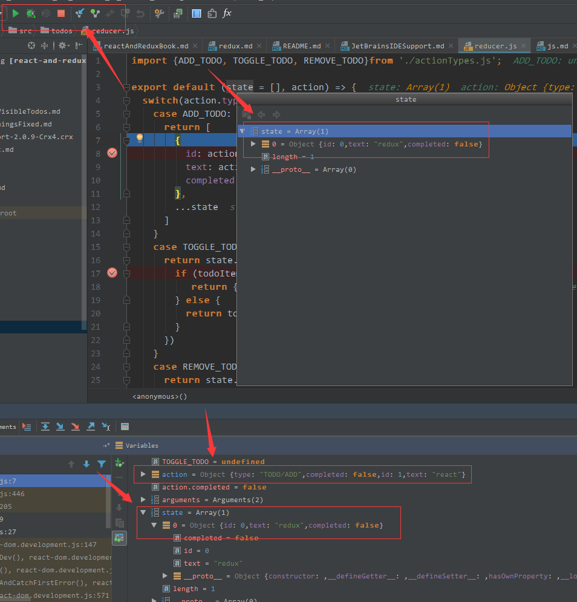

## 准备工作
> WebStorm 的 Javascript Debug 只能选择 Google chrome（至少在我的电脑上是这样），所以，JetBrains IDE Support 插件需要安装到 Google chrome 上。

1. [chrome 最新版下载](http://chromecj.com/category/chrome/)
1. 安装插件，在应用中心，搜索：JetBrains IDE Support，不过，由于众所周知的原因，如果你不能访问谷歌应用中心的话，可以下载离线版进行安装。
    * [离线安装包下载链接](https://www.crx4chrome.com/crx/768/)
    * 下载之后，先开启 chrome 的开发者模式（详情请见<a href="#chromePluginInstall">chrome 安装插件遇到的问题</a>），重启 chrome，再将文件直接拖至 chrome 的扩展页面，按照提示安装即可。  
    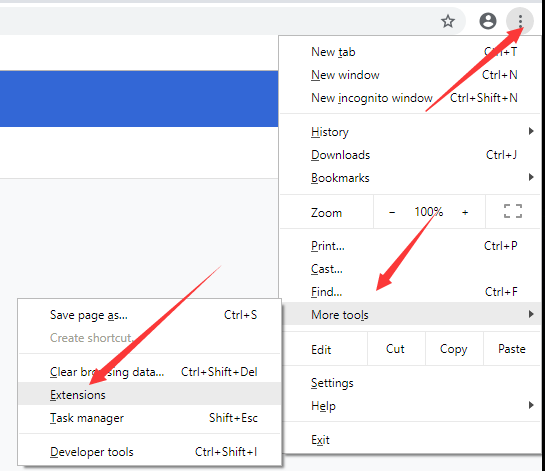
    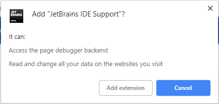
1. WebStorm 和 JetBrains IDE Support 端口设置成一样。  
    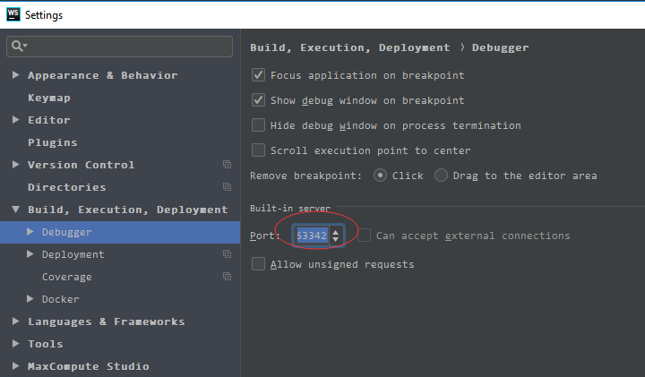  
    点击 JetBrains IDE Support 插件的 logo 右键，出来如下窗口，点击【Options】设置端口  
    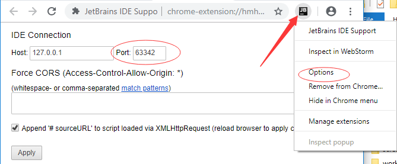
1. 添加 JavaScript Debug 启动项。  
    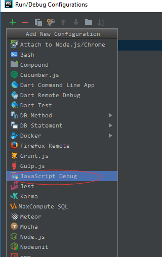  
    只能选择 chrome 浏览器  
    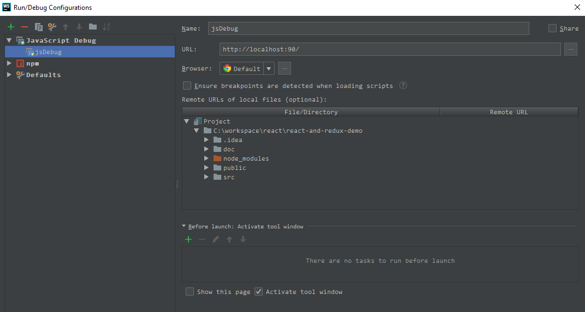

## 调试
1. 在 WebStorm 的【Terminal】窗口运行 `npm start`。  
    > 也可以按照如下配置，就象用 IDEA 开发 Java 程序一样配置启动项，然后直接点击小虫子左边的三角启动项目。 
     
    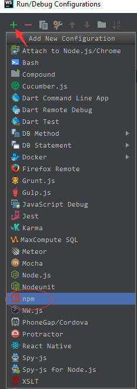
    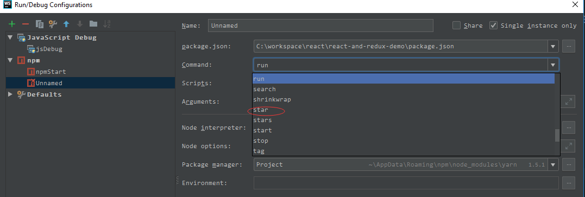
1. 选择刚才添加的【JavaScript Debug】启动项【jsDebug】，点击 Debug 按钮（小虫子），会打开 chrome 窗口，这时候的操作便会触发调试，尽情享受编程的乐趣吧~~~  
    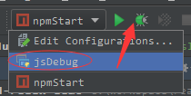  
    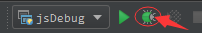

## <a name="chromePluginInstall">chrome 安装插件遇到的问题</a>
### 现象
提示：无法从该网站添加应用、扩展程序和用户脚本  
拖上去的插件，变成下载了，汗~~  
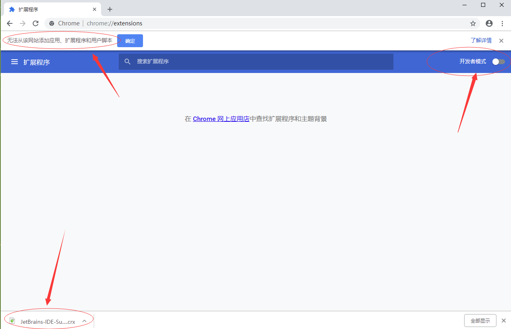
  
开启开发者模式，重新将插件拖上去，问题依旧。

### 解决
开启开发者模式之后，重启浏览器，重新安装，就一切正常了。看来开启开发都模式之后，需要重启浏览器才会生效。  
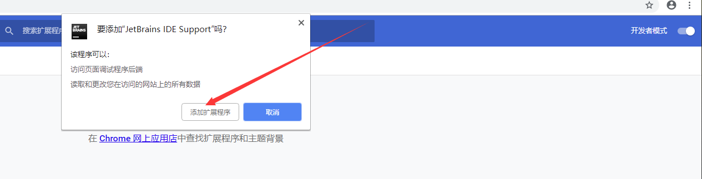  
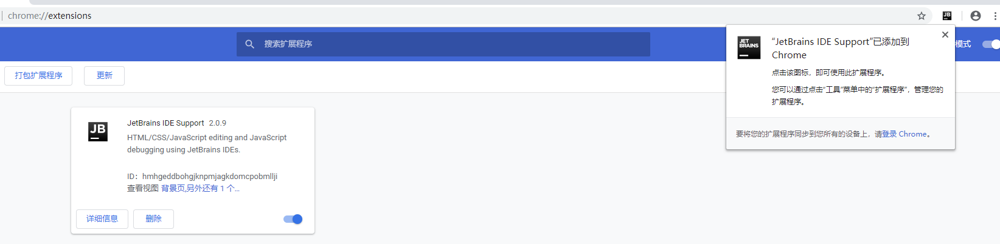
