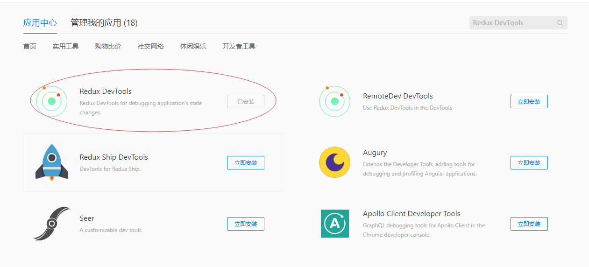
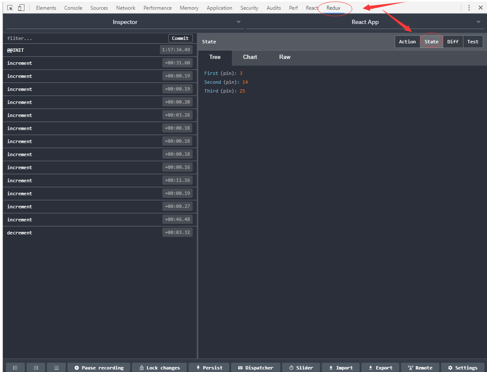
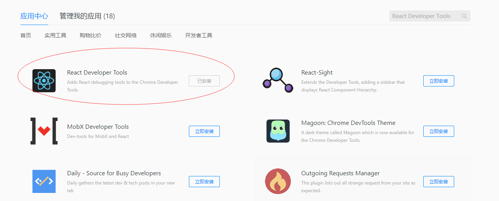
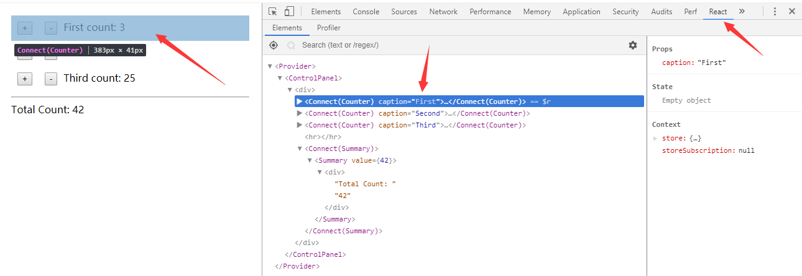
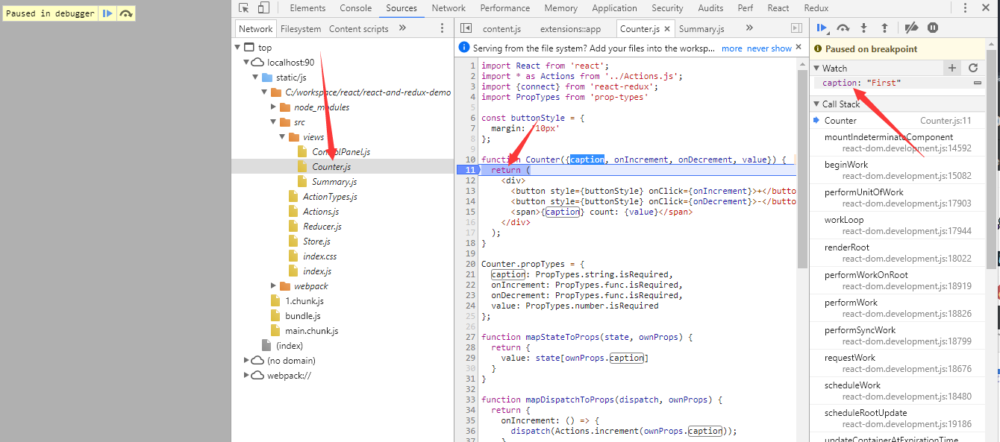

# React 项目调试技巧
1. 借助以下插件进行调试。
    * Redux DevTools
    * React Developer Tools
    * React Perf
1. F12 之后，在源代码处打断点。
1. [堪比 Java 代码调试的方案：用 WebStorm + JetBrains IDE Support 插件，在 WebStorm 内调试代码](./JetBrainsIDESupport.md)，直接在 WebStorm 源代码上打断点，调试起来有点象在 IDEA 下调试 Java 程序，很爽！

## Redux DevTools
1. 安装
以 qq 浏览器为例，搜索：Redux

1. 代码添加
    [参考](https://github.com/zalmoxisus/redux-devtools-extension#usage)
    对于分支 react-redux，要加上 redux-devtools-extension，只需要作如下调整:
    ```
    // 将 window.__REDUX_DEVTOOLS_EXTENSION__ && window.__REDUX_DEVTOOLS_EXTENSION__() 作为 createStore 方法的第三个参数，如下：
    const store = createStore(reducer, initValues, window.__REDUX_DEVTOOLS_EXTENSION__ && window.__REDUX_DEVTOOLS_EXTENSION__());
    ```
1. 使用
npm start 之后，在 chrome 或者 qq 浏览器，按 F12，点击【Redux】，可跟踪 Action 以及 state 的变化。


## React Developer Tools
1. 安装
以 qq 浏览器为例，搜索：React Developer Tools

1. 使用


## React Perf
性能插件，具体使用可参考《深入浅出React和Redux》，P101-102，【4.6.3 工具应用】章节。

## F12 之后，在源代码处打断点
可 F12 之后，点击【Sources】，在想要监控变量的地方打断点，这种方式还是非常方便的。


